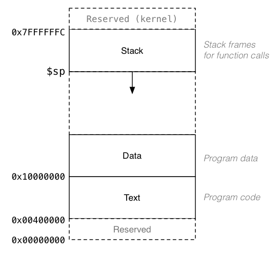

# Diciembre - Febrero

## Proyecto Informático I

### Ejercicio

Construir una aplicación web con Node/Express/Pug que cumpla con las siguientes pautas:
- El backend debe estar hecho en Node/Express.
- El frontend se realiza con plantillas de Pug.
- Todos los assets estáticos deben estar en la carpeta `public`.
- Si es necesario usar scripts del lado del cliente para manejar distintos eventos de la app.
- Para la base de datos se puede usar MongoDB, PostgreSQL o MySQL/MariaDB.
- No es necesario usar un ORM/ODM, pero se recomienda trabajar con MongoDB y Mongoose.
- El código de la app debe estar alojado en GitHub.
- Realizar el _deploy_ de la app a Heroku.
- El estilo de la app puede estar basado en algún framework de CSS como Bootstrap.
- **Extra**: se suman puntos por implementar una API estilo REST para operar sobre la base de datos con JSON.
- **Extra**: es deseable que la app tenga algún tipo de autenticación y autorización, usando Passport por ejemplo.

La aplicación web es a elección, pero se puede continuar el trabajo sobre el ejemplo de la trivia con las preguntas y respuestas en la base de datos. La app debe tener como mínimo dos tablas/colecciones que estén relacionadas de alguna manera.

El ejemplo de la trivia se puede encontrar en [Heroku](https://trivia-35.herokuapp.com).
El código está disponible en GitHub, seguir el link en el footer de la app.

Cada alumno debe presentar su aplicación en el período de diciembre - febrero. El trabajo es individual. Además de presentar la aplicación funcionando debe defender de manera oral el trabajo realizado. Es decir, el alumno debe entender el código o la mayor parte del mismo y dar evidencias de que realizó el trabajo honestamente.

## Organización de Computadoras

### Ejercicio

1. Hacer un fork de este repositorio y usar el archivo `solucion.asm` como plantilla para resolver el ejercicio.
2. Implementar en ensamblador de MIPS 32 el siguiente programa de C.

```c
#include <stdio.h>

// globals
int array[] = {2, 7, 4, 6, 5, 3, 1};
int size = 7;

// swap helper for arrays
void swap(int arr[], int i, int j) {
  int temp = arr[i];
  arr[i] = arr[j];
  arr[j] = temp;
}

// insertion sort for arrays of size n
void sort(int arr[], int n) {
  int i = 1;
  int j;
  while (i < n) {
    j = i;
    while (j > 0 && arr[j - 1] > arr[j]) {
      swap(arr, j, j - 1);
      j--;
    }
    i++;
  }
}

// main program
int main() {
  sort(array, size);
  for (int i = 0; i < size; i++)
    printf("%d ", array[i]);
  printf("\n");
  return 1;
}
```
3. Entender la implementación propuesta y defenderla de manera oral.
4. La solución propuesta tiene que implementar las funciones `swap` y `sort` tal como se realiza en el programa de C.
5. Usar instrucciones de la siguiente lista únicamente:
  - add
  - addi
  - sub
  - mul
  - move
  - sw
  - lw
  - li
  - la
  - slt
  - and
  - bne
  - beq
  - bge
  - j
  - jal
  - jr
  - syscall

### Arrays en ensamblador

No hay distinción entre arrays y variables simples en lenguaje ensamblador. Un array es simplemente una lista de variables que están contiguas en memoria. El manejo de los índices que se hace en C debe hacerse manualmente.


El siguiente ejemplo declara la etiqueta `array` que contiene la dirección base del array, es decir, la dirección de memoria del primer elemento: `array[0]`. El ciclo imprime cada número del array separados por un espacio. Cada elemento al ser números enteros de 32 bits ocupan 4 bytes, por eso las direcciones van de 4 en 4.

```assembly
.data                              # data segment
sp: .asciiz " "
array: .word 1, 2, 3, 4, 5, 6      # int array[] = {1, 2, 3, 4, 5, 6}

.text                              # code segment
.globl main

main:  li       $t0, 0             # int i = 0
       li       $t1, 6             # loopear mientras i < 6
loop:  bge      $t0, $t1, exit     # while (i < 3)
       la       $t3, array         # array base address
       mul      $t4, $t0, 4        # offset = i * 4 (cada word son 4 bytes)
       add      $t5, $t4, $t3      # address = offset + base address
       lw       $a0, 0($t5)        # $a0 = array[i]
       li       $v0, 1             # syscall code print integer
       syscall                     # printf("%d", array[i])
       la       $a0, sp            # $a0 = " "
       li       $v0, 4             # syscall code print string
       syscall                     # printf(" ")
       addi     $t0, $t0, 1        # i++
       j loop                      # volver a loopear
exit:  li       $v0, 10            # syscall code exit
       syscall                     # exit

```

### Funciones y el _call stack_

Una función es una subrutina de nuestro código que llamamos desde distintas partes del mismo.
En ensamblador, para saber a dónde debe retornar una función guardamos el valor del PC en un registro especial. En MIPS es el registro `$ra` por _return address_.

```assembly
sum:      add  $v0, $a0, $a1      # return a + b
          jr   $ra                # return
```

La función que está arriba ilustra varias cosas importantes. En primer lugar no hay nada de particular en cada registro de los 32 registros de MIPS, excepto por `$zero`. Para que distintos programadores puedan trabajar entre sí, se adoptan ciertas convenciones sobre el uso de los registros y el uso de la pila de llamadas.

Los registros `$a0`, `$a1`, `$a2` y `$a3` se usan para pasar argumentos a una función. El código que llama a la función setea los valores de estos registros y luego la invoca. Los registros `$v0` y `$v1` se usan para devolver valores de una función. En el ejemplo de la suma está claro que `$a0` y a `$a1` equivalen a `a` y `b` y que `$v0` equivale a `return a + b`.

```assembly
   li   $a0, 3             # a = 3
   li   $a1, 7             # b = 7
   jal  sum                # sum(3, 7)
```

Lo que hace la instrucción `jal` es guardar el PC en `$ra` y apuntar al código de la función en cuestión. Por último los registros `$s0 - $s7` y los `$t0 - $t9` se usan para propósitos generales, con la diferencia de que los primeros, llamados _saved temporaries_ se preservan a través de llamadas a funciones.

Lo que quiero decir con esto último es que pasa si mi función `fact` por ejemplo, usa `$ra` para saber a donde volver cuando termine de ejecutarse, pero a su vez llama a otra función.

```assembly
fact:     addi $sp, $sp, -8       # ajustar call stack para 2 words
          sw   $ra, 4($sp)        # push return address
          sw   $a0, 0($sp)        # push n (argumento)
          slti $t0, $a0, 1        # if (n < 1)
          beq  $t0, $zero, else   # if (n >= 1) goto else
          li   $v0, 1             # return 1
          lw   $a0, 0($sp)        # pop n
          lw   $ra, 4($sp)        # pop return address
          addi $sp, $sp, 8        # ajustar $sp despues de quitar 2 words
          jr   $ra                # return
else:     addi $a0, $a0, -1       # n = n - 1
          jal  fact               # fact(n - 1)
          lw   $a0, 0($sp)        # pop n
          lw   $ra, 4($sp)        # pop return address
          addi $sp, $sp, 8        # ajustar $sp despues de quitar 2 words
          mul  $v0, $a0, $v0      # return n * fact(n - 1)
          jr   $ra                # return
```

Después de `else` en la línea `jal fact` la función está sobreescribiendo `$ra` y cuando tenga que regresar al código de la función `main` no va a saber como. Para este tipo de situaciones la solución se conoce como pila de llamadas o _call stack_.

En cada llamada a una función siempre hay dos partes del código involucradas. La función que llama la función y la función que está siendo llamada. Nos referimos en inglés a estas dos partes como _caller_ y _callee_.

El _caller_ es responsable de guardar los registros `$t0 - $t9`, `$a0 - $a3` y `$v0 - $v1`, si fuera necesario. El _callee_ puede sobreescribir esos registros, se supone que si el código que llamó a la función los necesita ya los guardó.

El _callee_ es responsable de guardar los `$s0 - $s7` y `$ra`. Si los va a usar debe guardarlos. Si el _callee_, osea la función que está siendo invocada, no llama a otra función en su código no necesita guardar `$ra`, y solo debe guardar los registros que usa. La función suma de arriba es un ejemplo de función que no llama a otra función. En cambio factorial es una función recursiva (una función que se llama a sí misma) y su código tiene que preservar registros en memoria.

La forma de guardar estos registros para después restaurarlos es en memoria principal, en una estructura conocida como _call stack_ (pila de llamadas). En cada llamada a una función, si hay necesidad de preservar registros se modifica esta pila. Esto se hace al principio del código de la función y al final justo antes del `return` que en MIPS lo realizamos con `jr $ra`.

El _call stack_ en MIPS crece hacia abajo desde la dirección de memoria 0x7FFFFFFC que es el valor de `$sp` al inicio del programa. Por eso restamos para hacer lugar en la pila y sumamos para eliminar elementos.


