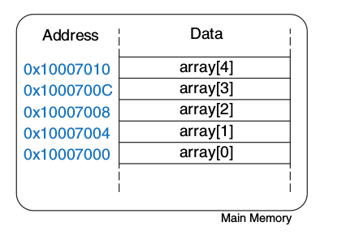

# Diciembre - Febrero

## Proyecto Informático I

### Ejercicio

Construir una aplicación web con Node/Express/Pug que cumpla con las siguientes pautas:
- El backend debe estar hecho en Node/Express.
- El frontend se realiza con plantillas de Pug.
- Todos los assets estáticos deben estar en la carpeta `public`.
- Si es necesario usar scripts del lado del cliente para manejar distintos eventos de la app.
- Para la base de datos se puede usar MongoDB, PostgreSQL o MySQL/MariaDB.
- No es necesario usar un ORM/ODM, pero se recomienda trabajar con MongoDB y Mongoose.
- El código de la app debe estar alojado en GitHub.
- Realizar el _deploy_ de la app a Heroku.
- El estilo de la app puede estar basado en algún framework de CSS como Bootstrap.
- **Extra**: se suman puntos por implementar una API estilo REST para operar sobre la base de datos con JSON.
- **Extra**: es deseable que la app tenga algún tipo de autenticación y autorización, usando Passport por ejemplo.

La aplicación web es a elección, pero se puede continuar el trabajo sobre el ejemplo de la trivia con las preguntas y respuestas en la base de datos. La app debe tener como mínimo dos tablas/colecciones que estén relacionadas de alguna manera.

El ejemplo de la trivia se puede encontrar en [Heroku](https://trivia-35.herokuapp.com).
El código está disponible en GitHub, seguir el link en el footer de la app.

## Organización de Computadoras

### Ejercicio

1. Hacer un fork de este repositorio y usar el archivo `solucion.asm` como plantilla para resolver el ejercicio.
2. Implementar en ensamblador de MIPS 32 el siguiente programa de C.

```c
#include <stdio.h>

// globals
int array[] = {2, 7, 4, 6, 5, 3, 1};
int size = 7;

// swap helper for arrays
void swap(int arr[], int i, int j) {
  int temp = arr[i];
  arr[i] = arr[j];
  arr[j] = temp;
}

// insertion sort for arrays of size n
void sort(int arr[], int n) {
  int i = 1;
  int j;
  while (i < n) {
    j = i;
    while (j > 0 && arr[j - 1] > arr[j]) {
      swap(arr, j, j - 1);
      j--;
    }
    i++;
  }
}

// main program
int main() {
  sort(array, size);
  for (int i = 0; i < size; i++)
    printf("%d ", array[i]);
  printf("\n");
  return 1;
}
```
3. Entender la implementación propuesta y defenderla de manera oral.
4. La solución propuesta tiene que implementar las funciones `swap` y `sort` tal como se realiza en el programa de C.
5. Usar instrucciones de la siguiente lista únicamente:
  - add
  - addi
  - sub
  - sw
  - lw
  - li
  - la
  - syscall
  - `completar lista...`

### Arrays en ensamblador

No hay distinción entre arrays y variables simples en lenguaje ensamblador. Un array es simplemente una lista de variables que están contiguas en memoria. El manejo de los índices que se hace en C debe hacerse manualmente.

 

El siguiente ejemplo declara la etiqueta `array` que contiene la dirección base del array, es decir, la dirección de memoria del primer elemento: `array[0]`. El ciclo imprime cada número del array separados por un espacio. Cada elemento al ser números enteros de 32 bits ocupan 4 bytes, por eso las direcciones van de 4 en 4.

```mips
.data                              # data segment
sp: .asciiz " "
array: .word 1, 2, 3, 4, 5, 6      # int array[] = {1, 2, 3, 4, 5, 6}

.text                              # code segment
.globl main

main:  li       $t0, 0             # int i = 0
       li       $t1, 6             # loopear mientras i < 6
loop:  bge      $t0, $t1, exit     # while (i < 3)
       la       $t3, array         # array base address
       mul      $t4, $t0, 4        # offset = i * 4 (cada word son 4 bytes)
       add      $t5, $t4, $t3      # address = offset + base address
       lw       $a0, 0($t5)        # $a0 = array[i]
       li       $v0, 1             # syscall code print integer
       syscall                     # printf("%d", array[i])
       la       $a0, sp            # $a0 = " "
       li       $v0, 4             # syscall code print string
       syscall                     # printf(" ")
       addi     $t0, $t0, 1        # i++
       j loop                      # volver a loopear
exit:  li       $v0, 10            # syscall code exit
       syscall                     # exit

```

### Funciones y el _call stack_

Breve explicación, completar...
